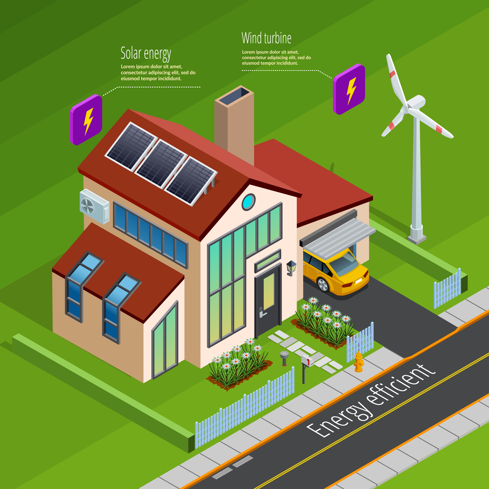
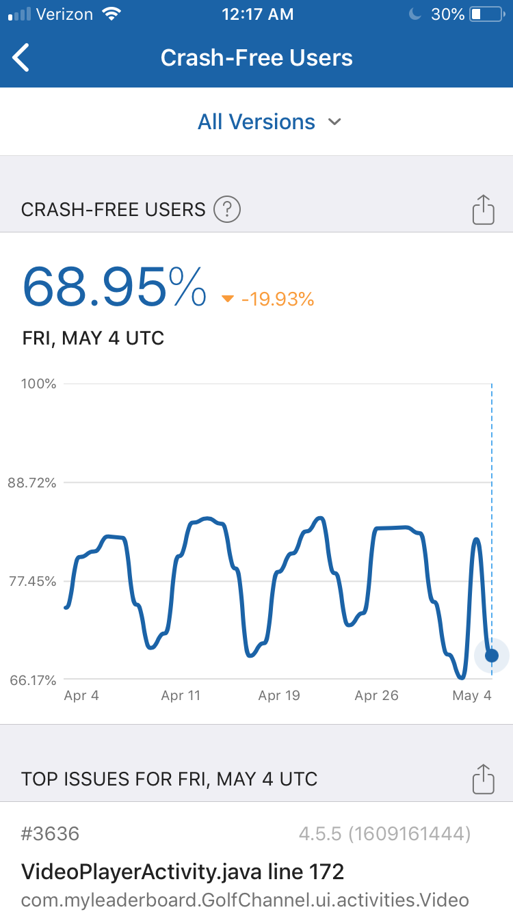
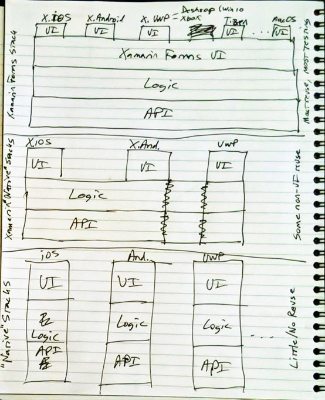
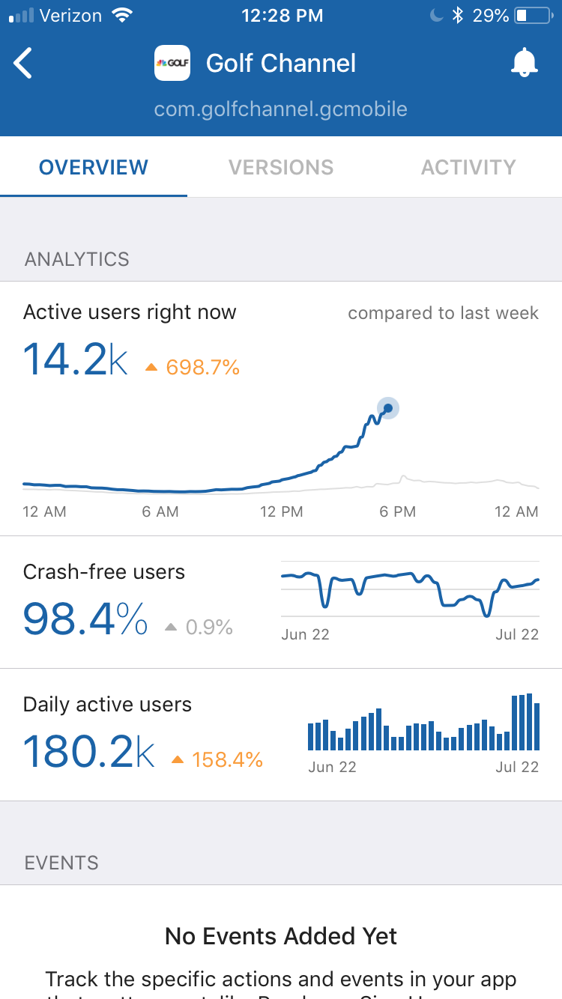

<!-- Title -->

<!-- _footer: "" -->
<!-- _paginate: skip -->

<!-- _class: talk_title invert -->

# Find Bugs Faster through ViewModel and API Library Testing

<br />

## Andy Lech

---

<!-- @@@ Sponsors @@@ -->

<!-- _footer: "" -->
<!-- _paginate: skip -->


---

<!-- @@@ Orlando Code Camp @@@ -->

<!-- _footer: "" -->
<!-- _paginate: skip -->


####  Seminole State College, Sanford, FL
[https://www.orlandocodecamp.com/](https://www.orlandocodecamp.com/)

---

<!-- @@@ Audience Questions @@@ -->

<!-- _class: talk_topics -->

### Audience Polls

* How many have written a mobile app before?
* How many have published an app to an app store?
* How many have used the MVVM pattern in their app?
* How many have separate API libraries in their app?

---

<!-- @@@ Topics @@@ -->

<!-- _class: talk_topics -->

### Topics

* What makes cross-platform and mobile different
* Real-world mobile design components
* Separating API consumption into testable libraries
* Testing how data flows through your ViewModels

---

<!-- @@@ Section 1 Title @@@ -->

<!-- _class: section_title -->

## Part 1

* ### Imagine your house was an app ...

---

<!-- @@@ House - User @@@ -->

<!-- _class: details -->


<div>

### Energy - User

##### *[Web Site or Mobile App]*

- Energy Consumption
  - Just Works
- Energy Production
  - Somebody Else's Problem
- Resiliency
  - Generator (Maybe?)
- <b>Focus</b>
  - <b>Living My Best Life</b>

</div>

<div class="attribution">
    <a href="https://www.freepik.com/free-vector/isometric-house-profile-concept_4278104.htm">
    Image by macrovector</a> on Freepik
    <p />
</div>

---

<!-- @@@ House - Grid @@@ -->

<!-- _class: details -->


<div>

### Energy - Power Grid

##### *[Web Site]*

- User Consumption
  - Always
- Grid Production
  - Our Problem
- Resiliency
  - Our Backups Have Backups (Hopefully)
- <b>Focus</b>
  - <b>Keeping the Lights On (Literally)</b>

</div>

<div class="attribution">
    <a href="https://www.freepik.com/free-vector/plumbing-problems-solution-isometric-infographic-poster_4283915.htm">
    Image by macrovector</a> on Freepik
    <br />
    <i>[Equivalent energy image not found]</i>
    <p />
</div>

---

<!-- @@@ House - Solar @@@ -->

<!-- _class: details -->



<div>

### Energy - Solar/Wind

###### *[Mobile App]*

- Energy Production
  - Local
- Grid Consumption
  - Backup
- Grid Production
  - Their Problem
- Resiliency
  - Battery, Power Grid
- <b>Focus</b>
  - <b>Smartly Using and Storing Energy</b>

</div>

<div class="attribution">
    <a href="https://www.freepik.com/free-vector/smart-home-energy-generation-isometric-poster_4188550.htm">
    Image by macrovector</a> on Freepik
    <p />
</div>

---

<!-- @@@ Section 2 Title @@@ -->

<!-- _class: section_title -->

## Part 2

* ### Mobile is just like Web but smaller,

* ### right!?

---

<!-- @@@ Web vs Mobile - High-level @@@ -->

<!-- _class: details -->

### Web vs Mobile - High Level


<div class="commentary" style="padding: 20px 0px 0px;">

* Same thing, right? Problem solved! Crisis averted!
Thank you and good night!

</div>

---

<!-- @@@ Web Architecture - Components @@@ -->

<!-- _class: details -->

### Web Architecture - Components

<p/>


<div class="detail-summary">

- Server/cloud stack is the focus here, turning data into pages and layouts
- Complex layouts are generally built on top of templating frameworks
- <b>Web devs expect fat data pipes in the server/cloud stack to get large data payloads (object graphs) to choose what to filter/display in page layouts</b>

</div>

---

<!-- @@@ Mobile Architecture - Components @@@ -->

### Mobile Architecture - Components

<!-- _class: details -->


<div class="detail-summary">

- App handles interactivity, page layouts, local caching, and API calls
- API stack delivers only data or status codes in response to app requests
- App pages tend to be focused on single tasks that call the API selectively
- <b>Mobile/API devs focus more on reliable, just-in-time data delivery</b>

</div>

---

<!-- @@@ Section 3 Title @@@ -->

<!-- _class: section_title -->

## Part 3

* ### You got Presentation Logic on my Business Logic

* ### You got Business Logic in my Presentation Logic

---

<!-- @@@ MVVM Architecture @@@ -->

<!-- _class: details -->

## MVVM Pattern - Theory

<br />


<div class="attribution">
    <a href="https://en.wikipedia.org/wiki/File:MVVMPattern.svg">
    Image from Wikipedia</a>
</div>

<br />

---

<!-- @@@ Mobile Architecture - Real World @@@ -->

<!-- _class: details -->

## Mobile Architecture - Real-world

| Component | Architecture | Purpose |
| - | - | - |
| Page Layouts | Views | Presentation |
| Navigation Logic | ViewModels | Navigation Router |
| Code Behind | ViewModels | Presentation Logic |
| Code Behind | ViewModels | Data Manipulation Logic |
| Local Caches | Data Service | Data Source Logic |
| Data Access | API Services | Data Translation Logic |
| Data Access | Models | Internal Data Definitions |
| Data Access | Data Transfer Objects | External Data Definitions |

---

<!-- @@@ Mobile Architecture - Network @@@ -->

<!-- _class: details -->

## Mobile Architecture - Network

<br />


---

<!-- @@@ Section 4 - Golf Channel @@@ -->

<!-- _class: section_title -->

## Part 4

* ### Why?

---

<!-- @@@ Golf Channel - Old Tablet Splash Screen (Bad) @@@ -->

<!-- _footer: "" -->
<!-- _paginate: skip -->


---

<!-- @@@ Golf Channel - Old Phone Splash Screen and Crashes @@@ -->

<!-- _footer: "" -->
<!-- _paginate: skip -->

<div class="columns-two">

<div class="column">


</div>

<div>



</div>

</div>

---

<!-- @@@ Golf Channel - VP Pitch @@@ -->

<!-- _footer: "" -->
<!-- _paginate: skip -->



---

<!-- @@@ Golf Channel - New Phone Splash Screen and Crashes @@@ -->

<!-- _footer: "" -->
<!-- _paginate: skip -->

<div class="columns-two">

<div class="column">


</div>

<div>



</div>

</div>

---

<!-- @@@ Section 5 - Testing @@@ -->

<!-- _class: section_title -->

## Part 5

* ### How?

---

<!-- @@@ Mobile Architecture - Real World @@@ -->

<!-- _class: details -->

## Mobile Architecture - Components

<div style="padding: 20px 0px;">

- ViewModels
  - Moving navigation out of the View allows ViewModels to be tested individually with frameworks like ReactiveUI (RxUI)
- Api Services
  - Individually testable to return app Models and not just Data Transfer Objects (DTOs)
- Data Service
  - Decides whether to call the local cache DB, the platform cache, an API endpoint, or a service based on the requested data and the app lifecycle

</div>

---

<!-- @@@ Mobile Architecture - Solution @@@ -->

<!-- _class: details -->

## Mobile Architecture - Solution

<br />


---

<!-- @@@ Mobile Architecture - Testing @@@ -->

<!-- _class: details -->

## Mobile Architecture - Testing

<br />


---

<!-- @@@ Section 6 - Problem Details @@@ -->

<!-- _class: section_title -->

## Part 6

* ### There is another way ...

---

<!-- @@@ Problem Details - Description @@@ -->

<!-- _class: details -->

<div class="columns-two">

<div>

#### Problem Details

##### *Pros*

- Extensible JSON object
- Provides context to status code
- Can report errors or warnings
- Supported in .NET without ASP.NET
- Returned by Refit's ApiException

##### *Cons*

- Buggy return type in ASP.NET
- .NET implementations follow JSON

</div>

<div>

```json
# NOTE: '\' line wrapping per RFC 8792
{
  "$schema": "https://json-schema.org/draft/2020-12/schema",
  "title": "An RFC 7807 problem object",
  "type": "object",
  "properties": {
    "type": {
      "type": "string",
      "format": "uri-reference",
      "description": "A URI reference that identifies the problem type."
    },
    "title": {
      "type": "string",
      "description": "A short, human-readable summary of the problem type."
    },
    "status": {
      "type": "integer",
      "description": "The HTTP status code generated by the origin server \
for this occurrence of the problem.",
      "minimum": 100,
      "maximum": 599
    },
    "detail": {
      "type": "string",
      "description": "A human-readable explanation specific to this occurrence \
of the problem."
    },
    "instance": {
      "type": "string",
      "format": "uri-reference",
      "description": "A URI reference that identifies the specific occurrence \
of the problem. It may or may not yield further information if dereferenced."
    }
  }
}
```

</div>

</div>

###### Source: IETF RFC 9457 - Problem Details for HTTP APIs [www.rfc-editor.org/rfc/rfc9457.html](https://www.rfc-editor.org/rfc/rfc9457.html)

---

<!-- @@@ Problem Details - Logic Failure Example @@@ -->

<!-- _class: details -->

#### Problem Details - Logic Failure Example

<div class="columns-two">

<div>

```json
POST /purchase HTTP/1.1
Host: store.example.com
Content-Type: application/json
Accept: application/json, application/problem+json

{
  "item": 123456,
  "quantity": 2
}
```

</div>

<div>

```json
HTTP/1.1 403 Forbidden
Content-Type: application/problem+json
Content-Language: en

{
 "type": "https://example.com/probs/out-of-credit",
 "title": "You do not have enough credit.",
 "detail": "Your current balance is 30, but that costs 50.",
 "instance": "/account/12345/msgs/abc",
 "balance": 30,
 "accounts": ["/account/12345",
              "/account/67890"]
}
```

</div>

</div>

---

<!-- @@@ Problem Details - Logic Failure Example @@@ -->

<!-- _class: details -->

#### Problem Details - Validation Failure Example

<div class="columns-two">

<div>

```json
POST /details HTTP/1.1
Host: account.example.com
Content-Type: application/json
Accept: application/json, application/problem+json

{
  "age": 42.3,
  "profile": {
    "color": "yellow"
  }
}
```

</div>

<div>

```json
HTTP/1.1 422 Unprocessable Content
Content-Type: application/problem+json
Content-Language: en

{
 "type": "https://example.net/validation-error",
 "title": "Your request is not valid.",
 "errors": [
             {
               "detail": "must be a positive integer",
               "pointer": "#/age"
             },
             {
               "detail": "must be 'green', 'red' or 'blue'",
               "pointer": "#/profile/color"
             }
          ]
}
```

</div>

</div>

---

<!-- _footer: "" -->
<!-- _paginate: skip -->

<!-- @@@ Section 7 - Questions? @@@ -->

<!-- _class: section_title -->

## Part 7

### Questions?


